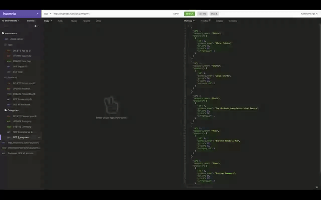
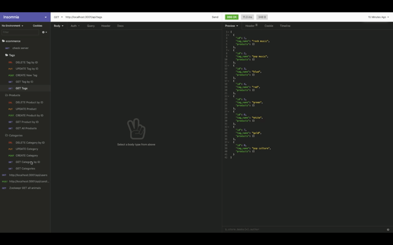
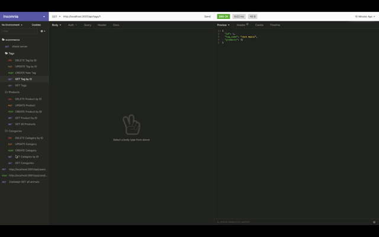

# ECommerce

## Description
The backend application for an e-commerce website that uses the latest technology. Upon entering MySQL username and password, the application will connect to a database. This database will be seeded with test data to demonstrate GET, POST, PUT, and DELETE function via Insomnia platform.

## Table of Contents

* [`Installation`](#installation)
* [`Technologies`](#technologies)
* [`Walkthrough`](#walkthrough)
* [`Deployment`](#deployment)
* [`Questions`](#questions)

## Installation
'npm run seed' to seed data to database to test routes

## Technologies
* Express.js
* MySQL
* Sequilize
* Insomnia

## Walkthroughs

GET ALL:

GET by ID:

POST | PUT | DELETE: 

## Deployment

<https://sidoniag.github.io/ECommerce/>

## Questions
Visit my github
<https://github.com/sidoniag>

Any questions can be emailed to me directly: <sidoniag@gmail.com>